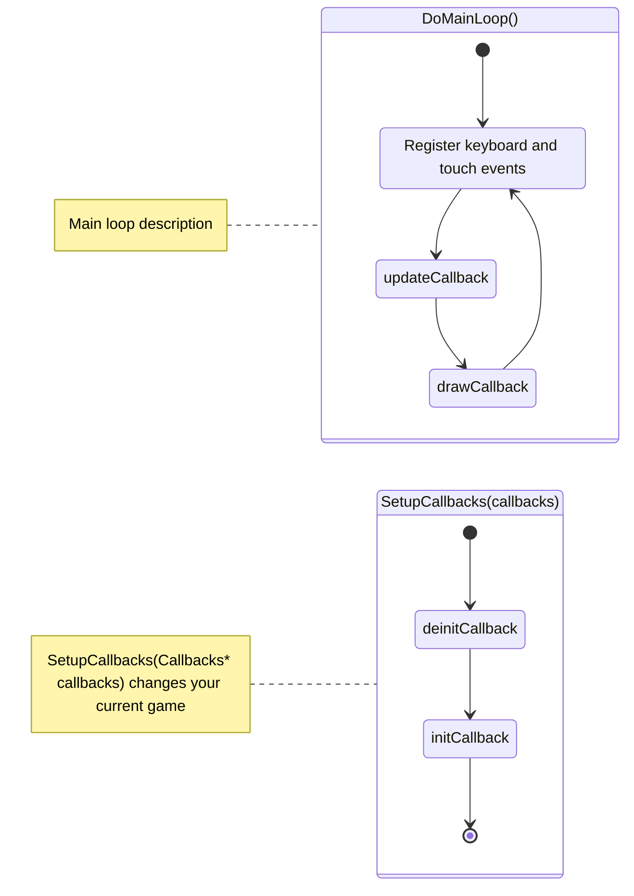
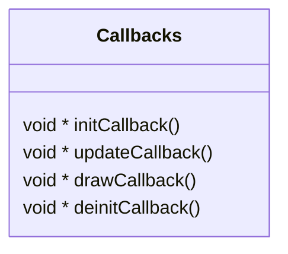

# Raspberry Pico Pocket Gamer

A Raspberry Pico __RP2040__ and __ILI9341__ based pocket console.

[Featured on MagPi Issue #122](https://magpi.raspberrypi.com/articles/pico-pocket-gamer)

> Watch the video by clicking on the image

[](https://www.youtube.com/watch?v=271OoiJQUyk "Raspberry Pico Pocket Gamer Video")


## Description

Since the Pico came out I wanted to create a project for it that I can show my son to, so I decided to make him a Pocket Console. The game repertoire is quite basic and consists of fourteen different games.

## Game list
|              |             |            |
|:------------:|:-----------:|:----------:|
| TicTacToe 1P | Labirinth   | Snake      |
| TicTacToe 2P | Connect4 1P | Calculator |
| Lights Out   | Connect4 2P | Pong       |
| Math         | 2048        | Breakout   |
| Tetramino    | Paint.NOT   |            |

## Hardware
Required components:
* Raspberry Pico (__RP2040__)
* __ILI9341__ controller with __XPT2046__ touch module (I am using 3.2'' version)
* five switches (preferably mechanical switches)

> Optional components:
> * Printed __PCB__ (gerber available within `extras` folder of this repository)
> * Button (switch) 6mm


## How to compile/run ?

Steps are similar (same) as with any other C++ Pico SDK based project.

```bash
mkdir build
cd build
cmake ..
make -j${nproc}
```

After which you should be able to find `build/PocketGamer.uf2` file to upload to your Pico microcontroller.

> __HINT__: In case you want to try the project without the Pico board `cd` into the `extras` folder and do a `make run`. I've adapted the interface and the main function to run on top of the olc's PixelGameEngine so you can try it directly from your Linux PC. Controls are `QWASD` and mouse click.

## Pinout
You should be able to find a compressed __gerber__ file with `extras` directory of the repository and order a new PCB online on which you can solder all the elements easily.

ILI9341 to Pico pin connections looks like this:
 
```
 ILI9341         Pico (RP2040)
 
 T_IRQ  <-----> PIN 20
 T_DO   <-----> PIN 8
 T_DIN  <-----> PIN 11
 T_CS   <-----> PIN 21
 T_CLK  <-----> PIN 10
 SDO    <-----> PIN 4
 LED    <-----> PIN 26 (or directly to 3v3)
 SCK    <-----> PIN 6
 SDI    <-----> PIN 7
 DC     <-----> PIN 18
 RESET  <-----> PIN 17
 CS     <-----> PIN 16
 GND    <-----> GND
 VCC    <-----> 3V3

```
 
 Additionally keyboard switches are added to the following pins:
 
```
                   Pico (RP2040)
 
 KEY_MENU  <-----> PIN 0
 KEY_UP    <-----> PIN 15
 KEY_DOWN  <-----> PIN 27
 KEY_LEFT  <-----> PIN 28
 KEY_RIGHT <-----> PIN 14

```

In case you need to change them they are all defined within their own source files: `src/interface.c`, `src/interface/ili9341.c` and `src/interface/ili9341_touchscreen.c`.

## Code explanation





> Should I add more detailed info here?
